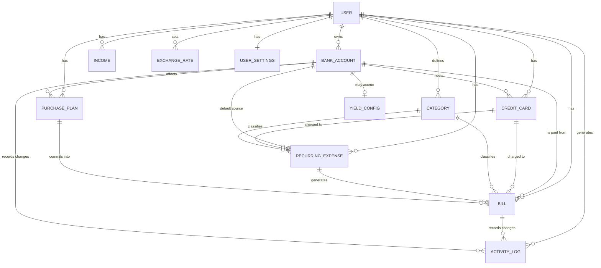

# 03 — Domain Model

Conceptual model of the app's entities and how they relate. Concrete column types live in
**doc 05 — Data Model**; the rules that operate on these entities live in **doc 04**.

Everything below is **scoped to a `user`**. Every entity has `id`, `userId`, `createdAt`,
`updatedAt` unless noted.

---

## 3.1 Entity–relationship diagram

---

## 3.2 Entities

### USER
Provided by Better‑Auth (`user`, `session`, `account`, `verification` tables already
exist). Do **not** modify auth tables. All domain tables reference `user.id`.

### BANK_ACCOUNT
A financial account the user holds at an institution.

| Field | Notes |
|-------|-------|
| `name` | e.g. "Nubank", "Mercado Pago", "XP" |
| `institution` | optional label / brand |
| `checkingBalance` | minor units; the spendable "Wallet" balance |
| `investmentBalance` | minor units; the "Invested" balance |
| `currency` | `'BRL'` or `'USD'` — the account's currency; both balances are in it |
| `color` / `icon` | optional UI accent to tell accounts apart |
| `archived` | hide without deleting |
| `sortOrder` | display order on dashboard |

A bank account **may** have one `YIELD_CONFIG` for its investment balance and **hosts zero
or more `CREDIT_CARD`s**. (Credit limits live on the card, not the account.)

### CREDIT_CARD
A credit card registered on a bank account. Its available credit is consumed by charges
(recurring expenses/subscriptions and one‑off bills) assigned to it. Drives the **Total
Credit** KPI.

| Field | Notes |
|-------|-------|
| `bankAccountId` | the account the card belongs to |
| `name` | e.g. "Nubank Ultravioleta", "Renner" |
| `brand` | optional (Visa/Master/…) |
| `creditLimit` | minor units; the card's total credit line |
| `currency` | `'BRL'` or `'USD'` |
| `closingDay` / `dueDay` | optional statement close / payment day |
| `color` / `icon` | UI accent |
| `archived`, `sortOrder` | as for accounts |

Derived (not stored): `used`, `available = creditLimit − used`. See doc 04 §4.3 for the
exact `used` definition.

### EXCHANGE_RATE
A stored conversion rate between two currencies (v1: BRL↔USD), used for all display/roll‑up
conversion _(extends source)_.

| Field | Notes |
|-------|-------|
| `base` / `quote` | currency pair, e.g. base `USD`, quote `BRL` |
| `rate` | integer scaled by `1e6` (e.g. 1 USD = 5.43 BRL → `5430000`) |
| `asOf` | when the rate was set/fetched |
| `source` | `manual` (v1) — room for a future feed |

### YIELD_CONFIG
Optional automatic growth for an account's investment balance _(extends source)_.

| Field | Notes |
|-------|-------|
| `bankAccountId` | 1:1 with the account |
| `annualRatePct` | e.g. `13.75` (% per year) |
| `compounding` | `monthly` (default) |
| `lastAccruedAt` | timestamp of the last applied accrual |
| `enabled` | on/off |

### CATEGORY
Classifies bills and recurring expenses (Housing, Utilities, Credit Card, Loan, Taxes,
Health, Subscription, Other…). Seeded with sensible defaults per user; user‑editable.

| Field | Notes |
|-------|-------|
| `name`, `color`, `icon` | display |
| `kind` | `expense` (v1 only expenses) |
| `isSystem` | seeded defaults vs. user‑created |

### BILL
A single dated payable — the atomic unit of the Bills sheet.

| Field | Notes |
|-------|-------|
| `name` | free text; duplicates allowed (see doc 02) |
| `amount` | minor units, > 0 |
| `currency` | `'BRL'` or `'USD'`; defaults to the source account's currency |
| `dueDate` | calendar date; its month = the bill's month |
| `paid` | boolean |
| `paidAt` | when it was marked paid (nullable) |
| `paidFromAccountId` | which `BANK_ACCOUNT` it was paid from (nullable until paid) |
| `paidFxRate` | FX rate applied if paid from an account in a different currency (nullable) |
| `sourceAccountId` | intended source account (default for payment) |
| `creditCardId` | if this charge is on a card instead of paid from checking (nullable) |
| `categoryId` | nullable |
| `recurringExpenseId` | set if generated by a template (nullable) |
| `purchasePlanId` | set if committed from a plan (nullable) |
| `installmentNumber` / `installmentTotal` | for installment bills, e.g. 3/12 (nullable) |
| `notes` | optional |

### RECURRING_EXPENSE
A template that generates `BILL`s. Unifies "recurring bills" and "subscriptions".

| Field | Notes |
|-------|-------|
| `name` | e.g. "Rent", "Spotify" |
| `defaultAmount` | minor units; seeds each generated bill (user can edit the instance) |
| `currency` | `'BRL'` or `'USD'` |
| `kind` | `bill` \| `subscription` |
| `categoryId` | nullable |
| `sourceAccountId` | default account to pay from (when not on a card) |
| `creditCardId` | if charged to a card instead of paid from checking (nullable); this is what consumes the card's credit |
| `frequency` | `monthly` \| `every_n_months` \| `manual` |
| `intervalMonths` | N for `every_n_months` (e.g. 3, 6); 1 for monthly |
| `renewDay` | day of month the charge falls on (1–31, clamped to month length) |
| `endMode` | `infinite` \| `until_date` \| `installments` |
| `endDate` | for `until_date` |
| `installmentsTotal` | for `installments` (e.g. 12) |
| `installmentsGenerated` | counter for how many have been emitted |
| `active` | on/off toggle (spreadsheet "Active") |
| `startDate` | first charge month |

> A **subscription** is simply a `RECURRING_EXPENSE` with `kind = 'subscription'`. The
> Subscriptions screen filters on that and surfaces the `active` toggle + a "Total
> Monthly" like the sheet.

### INCOME
Expected inflow used by projection.

| Field | Notes |
|-------|-------|
| `name` | e.g. "Salary", "Consulting" |
| `amount` | minor units, monthly baseline |
| `currency` | `'BRL'` or `'USD'` |
| `dayOfMonth` | optional expected pay day |
| `active` | on/off |

Per‑month overrides (a specific month expects a different amount) are stored in
`INCOME_OVERRIDE` (`month` = `YYYY-MM`, `amount`). See doc 04 §4.8.

### PURCHASE_PLAN
A what‑if future expense whose balance impact is simulated _(extends source)_.

| Field | Notes |
|-------|-------|
| `name` | e.g. "New Car" |
| `totalAmount` | minor units |
| `currency` | `'BRL'` or `'USD'` (defaults to source account's) |
| `mode` | `lump_sum` \| `installments` |
| `installments` | N (for installments) |
| `startDate` | when it begins |
| `sourceAccountId` | account it draws from |
| `status` | `draft` \| `committed` (committed = bills generated) |
| `notes` | optional |

### ACTIVITY_LOG
Append‑only history of balance‑affecting actions (for the activity feed + undo)
_(extends source)_.

| Field | Notes |
|-------|-------|
| `type` | `bill_paid` \| `bill_unpaid` \| `balance_edited` \| `yield_accrued` \| `transfer` \| … |
| `bankAccountId` | affected account (nullable) |
| `billId` | related bill (nullable) |
| `amount` | signed minor units delta (nullable) |
| `balanceAfter` | account balance after the action (nullable) |
| `meta` | JSON for extra context |
| `occurredAt` | timestamp |

### USER_SETTINGS
Per‑user preferences and projection defaults.

| Field | Notes |
|-------|-------|
| `baseCurrency` | `'BRL'` |
| `projectionHorizonMonths` | default 10 (matches sheet) |
| `defaultAdditionalSpend` | minor units used to seed projection rows |
| `weekStartsOn`, `locale`, `theme` | UI prefs (theme defaults to dark) |

---

## 3.3 Key relationships & lifecycle notes

- **Recurring → Bills is generative, not live.** Generating creates real, editable `BILL`
  rows (so the user can adjust a single month's amount, exactly like the sheet). Changing
  a template does **not** retro‑edit already‑generated bills.
- **Paying a bill** links it to a `BANK_ACCOUNT` (`paidFromAccountId`) and writes an
  `ACTIVITY_LOG` row; the account's `checkingBalance` decreases. See doc 04 §4.5.
- **Purchase plan → Bills** only happens on **commit**; a draft plan is pure simulation.
- **Categories & accounts are soft‑referenced**: deleting one should be blocked or
  nullify references, never cascade‑delete bills (see doc 04 §4.10).
- **Credit cards are first‑class** (`CREDIT_CARD`), registered on an account. A charge is
  "on a card" when a `RECURRING_EXPENSE`/`BILL` sets `creditCardId`. A card's `used`/
  `available` credit is **derived** from its assigned charges; **Total Credit** = Σ
  available across cards (doc 04 §4.3). This is separate from settling the card: a monthly
  "Credit Card X" statement is still an ordinary `BILL` paid from checking.
- **Subscriptions relate to credit**: a subscription (`kind='subscription'`) with a
  `creditCardId` is a recurring monthly cost of that card — it both appears on the
  Subscriptions screen and contributes to the card's used credit.
- **Currency & FX**: every money‑bearing entity stores its own `currency`. Cross‑currency
  roll‑ups and display convert through `EXCHANGE_RATE` (doc 04 §4.1a). Accounts are
  single‑currency; a bill may differ from its paying account (conversion on payment).
